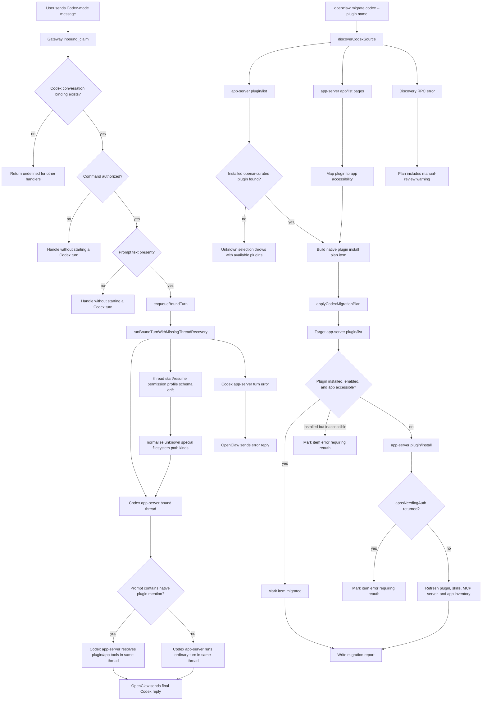

# Codex Native Plugin Apps Flow

## Overview

This flow describes how OpenClaw uses native Codex plugin/app support instead of registering OpenClaw `codex_plugin_*` bridge tools. It covers two related paths: runtime plugin invocation through the existing bound Codex app-server thread, and migration-time activation of source-installed Codex plugins through app-server control RPCs.

## Entry Points

- `extensions/codex/src/conversation-binding.ts:handleCodexConversationInboundClaim`
- `extensions/codex/src/migration/plan.ts:buildCodexMigrationPlan`
- `extensions/codex/src/migration/apply.ts:applyCodexMigrationPlan`

## Sequence Diagram



## Execution Trace

### 1. Runtime Turns Stay In The Bound Codex Thread

OpenClaw receives the user message through the existing Codex conversation binding and forwards the prompt text to the same Codex app-server thread. Native plugin mentions such as `[@Google Calendar](plugin://google-calendar)` remain in the prompt for Codex app-server to resolve; OpenClaw does not synthesize a `codex_plugin_*` tool.

#### 1.1 Register The Bound Conversation Handler

The Codex extension resolves the live plugin configuration and registers an inbound claim handler for Codex-bound conversations.

- `extensions/codex/index.ts:register`

```ts
register(api)
  livePluginConfig := resolveLivePluginConfigObject(openClawConfig)
  api.conversation.registerInboundClaimHandler(event, ctx =>
    handleCodexConversationInboundClaim(event, ctx, {
      pluginConfig: livePluginConfig,
    })
  )
```

#### 1.2 Claim Authorized Codex Messages

The handler requires an existing Codex conversation binding, command authorization, and non-empty prompt text before starting a Codex turn.

- `extensions/codex/src/conversation-binding.ts:handleCodexConversationInboundClaim`

```ts
handleCodexConversationInboundClaim(event, ctx, options)
  data := readCodexConversationBindingData(ctx.pluginBinding)
  if not data
    return undefined

  if event.commandAuthorized !== true
    return { handled: true }

  prompt := trim(event.bodyForAgent) || trim(event.content) || ""
  if prompt is empty
    return { handled: true }

  result := enqueueBoundTurn(data.sessionFile, () =>
    runBoundTurnWithMissingThreadRecovery({
      data,
      prompt,
      event,
      pluginConfig: options.pluginConfig,
      timeoutMs: options.timeoutMs,
    })
  )

  return { handled: true, reply: result.reply }
```

#### 1.3 Let Codex App-Server Own Native Plugin Execution

The bound turn passes the prompt to the app-server thread. If the prompt includes a native plugin mention, app-server plugin/app support owns tool discovery, activation semantics, auth, transcript semantics, and final assistant output in that same thread.

- `extensions/codex/src/conversation-binding.ts:runBoundTurnWithMissingThreadRecovery`

```ts
runBoundTurnWithMissingThreadRecovery(args)
  try
    return runBoundTurn(args)
  catch missingThread
    recover or recreate the bound app-server thread
    return runBoundTurn(args)

runBoundTurn(args)
  response := requestCodexAppServerJson("thread/turn/start", {
    threadId: args.data.threadId,
    prompt: args.prompt,
    cwd: args.data.cwd,
  })
  return response.finalMessage
```

### 2. The App-Server Protocol Exposes Native Plugin Control

OpenClaw uses typed app-server methods for plugin/app listing and installation. The protocol validators also tolerate known live schema drift in thread permission profiles so app-server thread start/resume remains the compatibility boundary, not OpenClaw plugin execution.

#### 2.1 Declare Plugin And App Control RPCs

The app-server protocol map records the response type for native plugin and app methods that migration code calls.

- `extensions/codex/src/app-server/protocol.ts:CodexAppServerRequestResultMap`

```ts
CodexAppServerRequestResultMap := {
  "plugin/list": PluginListResponse,
  "plugin/install": PluginInstallResponse,
  "app/list": AppsListResponse,
  "skills/list": SkillsListResponse,
  "config/mcpServer/reload": undefined,
  "thread/turn/start": ThreadTurnStartResponse,
}
```

#### 2.2 Normalize Permission Profile Drift

Thread start and resume responses are normalized before schema assertion so an unknown app-server `special` filesystem path kind is represented as an explicit unknown value.

- `extensions/codex/src/app-server/protocol-validators.ts:assertCodexThreadStartResponse`

```ts
assertCodexThreadStartResponse(value)
  normalized := normalizeThreadPermissionProfile(value)
  return assertCodexShape(validateThreadStartResponse, normalized, "thread/start response")

normalizePermissionProfileFileSystemPath(value)
  if value.type !== "special"
    return value
  if value.value.kind is known
    return value
  return value with value := {
    kind: "unknown",
    path: value.value.kind,
    subpath: value.value.subpath ?? null,
  }
```

### 3. Migration Discovery Reads Native Codex Inventory

When the user asks migration to include Codex plugins, discovery reads the source Codex home for skills and archived config, and asks Codex app-server which `openai-curated` plugins and apps are currently installed.

#### 3.1 Discover Codex Home Sources

The source scan discovers Codex skills, personal AgentSkills, cached plugin bundles for manual review, archiveable Codex config paths, and native plugin inventory returned by app-server.

- `extensions/codex/src/migration/source.ts:discoverCodexSource`

```ts
discoverCodexSource(input, options)
  codexHome := resolveHomePath(trim(input) || defaultCodexHome())
  codexSkills := discoverSkillDirs({ root: codexHome / "skills", excludeSystem: true })
  personalAgentSkills := discoverSkillDirs({ root: personalAgentsSkillsDir() })
  nativePlugins := discoverInstalledOpenAiCuratedPlugins({
    codexHome,
    pluginConfig: readCodexPluginConfigFromOpenClawConfig(options.config),
    config: options.config,
    appServerRequest: options.appServerRequest,
  })
  cachedPluginDirs := discoverPluginDirs(codexHome)
  archivePaths := existing config.toml and hooks/hooks.json
  return CodexSource with skills, nativePlugins, plugins, archivePaths, and warnings
```

#### 3.2 Map Installed Curated Plugins To App Accessibility

The app-server plugin inventory provides installed plugin metadata. The paginated app inventory lets migration warn when an already installed plugin is not currently accessible because app auth or availability is missing.

- `extensions/codex/src/migration/source.ts:discoverInstalledOpenAiCuratedPlugins`

```ts
discoverInstalledOpenAiCuratedPlugins(params)
  request := params.appServerRequest ?? defaultAppServerRequest(params)
  listed := request("plugin/list", { cwds: [] })
  apps := listAllApps(request)
  marketplace := listed.marketplaces.find(entry => entry.name === "openai-curated")
  if not marketplace
    return { plugins: [] }

  return marketplace.plugins
    .filter(plugin => plugin.installed)
    .map(plugin => ({
      marketplaceName: marketplace.name,
      marketplacePath: marketplace.path,
      pluginName: plugin.name,
      displayName: plugin.title || plugin.name,
      sourceInstalled: plugin.installed,
      sourceEnabled: plugin.enabled,
      accessible: pluginAccessible(plugin, apps),
    }))
```

### 4. Migration Planning Emits Native Plugin Activation Items

The migration plan turns selected native source plugins into `kind: "plugin"` install items with native-thread metadata. It also adds only the OpenClaw configuration necessary for the Codex extension itself to run.

#### 4.1 Select Requested Source Plugins

Selected plugin names are matched against source inventory by plugin name, display name, ids, and scoped `@openai-curated` names. Unknown selections fail at plan time with available plugin names.

- `extensions/codex/src/migration/plan.ts:selectCodexPlugins`

```ts
selectCodexPlugins({ plugins, selected })
  if selected is empty
    return []

  for ref in selected
    match := plugins.find(plugin =>
      ref matches plugin.name or plugin.id or displayName or scoped openai-curated name
    )
    if not match
      throw Error("Unknown Codex plugin selection")
    selectedPlugins.push(match)

  return selectedPlugins
```

#### 4.2 Build Native Plugin Items

Each selected source-installed plugin becomes a native activation item. The item deliberately describes app-server installation, not an OpenClaw dynamic tool registration.

- `extensions/codex/src/migration/plan.ts:buildCodexPluginItems`

```ts
buildCodexPluginItems({ ctx, plugins })
  items := []
  for plugin in plugins
    items.push(createMigrationItem({
      kind: "plugin",
      action: "install",
      status: "planned",
      source: plugin.id,
      target: "codex app-server plugin",
      details: {
        marketplaceName: plugin.marketplaceName,
        marketplacePath: plugin.marketplacePath,
        pluginName: plugin.pluginName,
        nativeThreadPlugin: true,
        sourceInstalled: plugin.sourceInstalled,
        sourceEnabled: plugin.sourceEnabled,
        accessible: plugin.accessible,
      },
    }))

  items.push(...buildCodexPluginConfigItems({ ctx }))
  return items
```

#### 4.3 Add Only Codex Extension Config

The migration enables the OpenClaw Codex extension and, when the user's config uses a restrictive plugin allowlist, appends only `codex` to that allowlist.

- `extensions/codex/src/migration/plan.ts:buildCodexPluginConfigItems`

```ts
buildCodexPluginConfigItems({ ctx })
  items := [
    config merge item for plugins.entries.codex.enabled = true,
  ]

  if ctx.config.plugins.allow is string array and does not include "codex"
    items.push(config merge item appending "codex")

  return items
```

### 5. Migration Apply Installs Through Codex App-Server

Apply resolves the current target app-server marketplace, installs selected plugins through `plugin/install`, refreshes the app-server runtime inventories, then writes the migration report.

#### 5.1 Build The Target App-Server Request

The default request path launches or contacts Codex app-server using the target OpenClaw Codex plugin configuration while pointing `CODEX_HOME` at the selected source home when provided.

- `extensions/codex/src/migration/apply.ts:defaultAppServerRequest`

```ts
defaultAppServerRequest(ctx)
  runtimeOptions := resolveCodexAppServerRuntimeOptions({
    pluginConfig: readCodexPluginConfigFromOpenClawConfig(ctx.config),
  })
  env := process.env
  if ctx.source is set
    env.CODEX_HOME := ctx.source
  return (method, params) =>
    requestCodexAppServerJson(method, params, {
      ...runtimeOptions,
      env,
    })
```

#### 5.2 Activate Selected Plugins

The activation loop validates each plan item's marketplace and app accessibility, skips already installed and enabled plugins, installs missing plugins, and converts app auth requirements into item-level errors.

- `extensions/codex/src/migration/apply.ts:applyCodexPluginActivationItems`

```ts
applyCodexPluginActivationItems({ ctx, items })
  request := appServerRequestForTests ?? defaultAppServerRequest(ctx)
  listed := request("plugin/list", { cwds: [] })
  marketplace := listed.marketplaces.find(entry => entry.name === "openai-curated")

  for item in items
    detail := readPluginDetail(item)
    plugin := marketplace.plugins.find(entry => entry.name === detail.pluginName)

    if detail is invalid or marketplace missing or plugin missing
      mark item as error
    else if plugin.installed and plugin.enabled and detail.accessible === false
      mark item as error requiring app reauth
    else if plugin.installed and plugin.enabled
      mark item as migrated
    else
      response := request("plugin/install", {
        marketplacePath: marketplace.path,
        pluginName: detail.pluginName,
      })
      if response.appsNeedingAuth is not empty
        mark item as error requiring app auth
      else
        mark item as migrated

  if any install changed app-server state
    refreshCodexPluginRuntime(request)
```

#### 5.3 Refresh Runtime Inventory And Write The Report

After an install changes app-server state, apply forces plugin, skills, MCP server, and app inventory refreshes before writing the final report.

- `extensions/codex/src/migration/apply.ts:refreshCodexPluginRuntime`

```ts
refreshCodexPluginRuntime(request)
  request("plugin/list", { forceReload: true, cwds: [] })
  request("skills/list", { forceReload: true })
  request("config/mcpServer/reload", {})
  request("app/list", { forceRefetch: true, limit: 50 })

applyCodexMigrationPlan(input)
  plan := input.plan ?? buildCodexMigrationPlan(input.ctx)
  pluginItems := applyCodexPluginActivationItems({ ctx: input.ctx, items: plannedPluginItems })
  configItems := apply config merge items, including the codex allowlist merge
  archiveItems := copy or archive source files
  result := MigrationApplyResult(pluginItems + configItems + archiveItems)
  writeMigrationReport(result, { title: "Codex Migration Report" })
  return result
```

## Notes

- OpenClaw no longer keeps a backwards-compatible `codex_plugin_*` dynamic tool bridge. Runtime plugin calls use native Codex mention text in the existing bound thread.
- Codex app-server owns plugin execution semantics: app auth, permission prompts, app/tool transcript shape, and plugin availability all remain native Codex behavior.
- Migration auto-activates only source-installed `openai-curated` plugins discovered through app-server inventory. Cached plugin bundle directories under `CODEX_HOME/plugins/cache` remain manual-review migration items.
- `plugins.allow` migration is limited to enabling the OpenClaw `codex` extension when the user's config already has a restrictive allowlist. It does not add OpenClaw dynamic tools for each selected Codex plugin.
- If app-server plugin discovery fails, the plan still reports skills and archiveable Codex files when available, and includes a manual-review warning for native plugin setup.
- If a selected plugin is already installed and enabled but its related app is inaccessible, apply marks that item as an error rather than silently treating it as usable.
- Unknown `special` filesystem path kinds in app-server permission profiles are normalized before validation so live app-server schema drift does not block thread start or resume.

## Observability

Metrics:

- None identified in this flow. The implementation relies on app-server responses, migration item statuses, and test/showboat evidence rather than dedicated counters.

Logs:

- `extensions/codex/src/conversation-binding.ts:handleCodexConversationInboundClaim` sends a user-visible error reply when a bound Codex app-server turn fails.
- `extensions/codex/src/migration/apply.ts:applyCodexMigrationPlan` writes a `Codex Migration Report` with migrated, skipped, conflict, and error item statuses.

## Related docs

- [Codex native plugin app spec](../plan/codex-native-plugin-apps.md)
- [Codex harness docs](../plugins/codex-harness.md)
- [openclaw migrate docs](../cli/migrate.md)
- [Configure and invoke plugins PR](https://github.com/openclaw/openclaw/pull/78443)
- [Codex plugin migration PR](https://github.com/openclaw/openclaw/pull/78444)

## Manual Notes

[keep this for the user to add notes. do not change between edits]

## Changelog

- 2026-05-06: Created Codex native plugin apps flow doc. (codex/019dfbd4-fa58-7050-9ac1-1fa0ac8cfce8 - 6beeff01c9)
